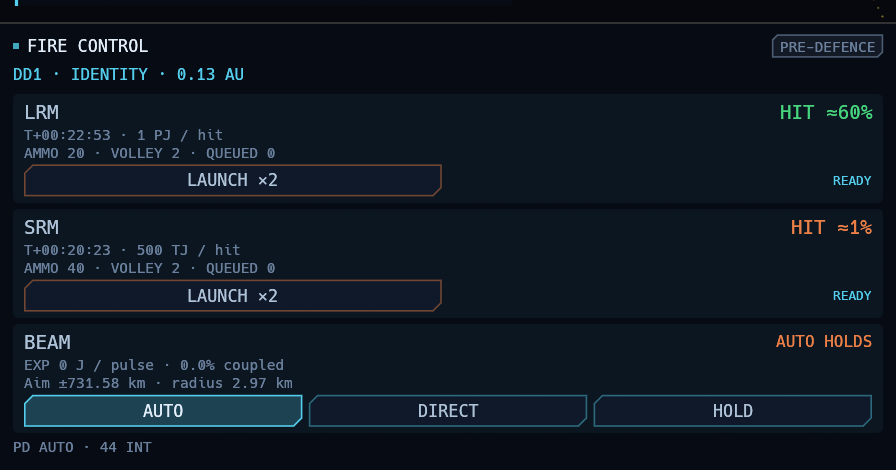

# Fire control and 3 LS point-defence validation

This report supersedes earlier same-day tuning snapshots. The earlier CSVs remain historical evidence, not measurements of the final settings.

## Final behaviour

- Fire control fills its allotted area with separate LRM, SRM and beam cards. Missile cards show estimated hit chance, flight time, energy per hit, available ammunition, effective volley, queued rounds and readiness. Beam predictions share the actual automatic fire-control calculation: expected coupled energy, coupling fraction and transverse aim uncertainty. Unknown information is not presented as zero hit chance. All estimates are before enemy defence, screens and armour; missile estimates also exclude unknown ECM.
- A newly resolved enemy ship is selected when there is no hostile target. Existing targets and movement orders are preserved. Interceptors and offensive missiles launched by resolved ships become immediately resolved and stay tracked until retired.
- Main-beam coupling retains its ordinary spread inside 6 LS, then smoothly tapers to zero at 10 LS. AUTO also considers predicted coupling and aim uncertainty beyond 6 LS. Forced shots beyond the envelope still spend energy and heat. Spinal mounts retain their separate 60 LS envelope.
- PD lasers engage within 3 LS. Each mount stays assigned to one threat through independent five-second reloads; a larger battery can cover more simultaneous missiles. The per-pulse probability uses the received closing speed and distance to the missile's burst radius, calibrated to approximately 50% cumulative interception over a complete approach. Damage slows reloads; heat dumping, thermal limits and disabled systems inhibit firing. Partial coverage and saturation reduce performance. Very slow closing speeds use a 1,000 km/s calibration floor; hovering rounds do not remain indefinitely safe.
- Each interceptor gets one hit/miss attempt and is then spent. The ship may launch a fresh interceptor against a surviving round. The regression explicitly calls guidance again after both terminal outcomes and checks that no second result or destruction is produced.
- SRM flight times now account for inherited closing velocity. Hull repair is 1% per hour and screens recharge 0.2 percentage points per minute.

## Isolated defence survey

[Raw results](defence-3ls.csv): 9,216 attacks, 512 deterministic seeds per cell; SRM/LRM × 0/2,000/19,000 km/s initial closure × 0/1/40 interceptors. One missile at a time, cold stationary frigate defender with two PD lasers, no screens, ECM or evasion, resolved launch solution at 0.03 AU. The world uses the real sensor, launch, guidance, laser pulse and destruction paths. Missile guidance/warhead misses are counted separately from defence kills.

| Attack / defence | Interceptor stops | Laser stops among interceptor survivors | Combined defence stops |
|---|---:|---:|---:|
| SRM, lasers only | — | 50.3% | 50.3% |
| SRM, one interceptor available | 75.5% | 50.1% | 87.8% |
| SRM, stocked interceptor battery | 97.7% | 51.4% | 98.9% |
| LRM, lasers only | — | 48.9% | 48.9% |
| LRM, one interceptor available | 47.1% | 47.8% | 72.4% |
| LRM, stocked interceptor battery | 88.8% | 48.3% | 94.2% |

The requested 75% followed by 50% describes an SRM facing one interceptor attempt and then laser defence. It does not describe a fully stocked battery with time to launch repeated fresh interceptors. LRM interceptor resistance is intentionally retained from the earlier balance request. Laser-only estimates use 1,536 attacks per missile type; conditional rates after stocked interception have much smaller survivor samples.

No missile damage, offensive magazine, or interceptor magazine changes were needed for the final 3 LS laser calibration. The main-beam taper and defence assignment are included in the full battles below.

## Full battles

[Closing duels](classes-3ls.csv): five seeds (2000–2004) per class, like-class ships, stock fittings, 0.35 AU separation and 2,000 km/s closure.

| Class | Beam/spinal finishes | Missile finishes | Draws | SRM hits | LRM hits | PD laser kills |
|---|---:|---:|---:|---:|---:|---:|
| Picket | 0 | 4 | 1 | 28 | 0 | 14 |
| Frigate | 5 | 0 | 0 | 12 | 0 | 45 |
| Destroyer | 5 | 0 | 0 | 36 | 0 | 93 |
| Cruiser | 5 | 0 | 0 | 89 | 1 | 99 |
| Battleship | 4 | 1 | 0 | 254 | 4 | 209 |

[Close-start duels](close-3ls.csv): two seeds per class (3000–3001), 0.01 AU separation, initially stationary. All ten ended in missile kills, with both sides returning fire; this is deliberately dangerous inside the missile engagement envelope.

The closing samples retain rare penetrating missile criticals and mostly beam/spinal finishes for beam-equipped ships. The picket has no offensive beam and can exhaust its magazine without a kill. These samples demonstrate the desired progression, not precise matchup win rates.

## Checks and delivery

- 286 regular workspace tests passed, plus all eight explicitly run extended tests/surveys.
- Clippy passed with warnings denied.
- The close-exchange regression records ten delivered hits per side and both ships lost. Its minimum exchange interval now spans two LRM reloads rather than a brittle fixed thirty-second threshold.
- The firing-solution panel was rendered and visually inspected with no target and with a resolved contact. Screenshot pre-runs now enable the hostile AI before advancing time.
- Auto-target regression verifies missile contacts are skipped, an existing target is preserved, and transport-follow orders remain intact.
- The installed binary matches the release build. The active game was not restarted; the changes apply on its next launch.
