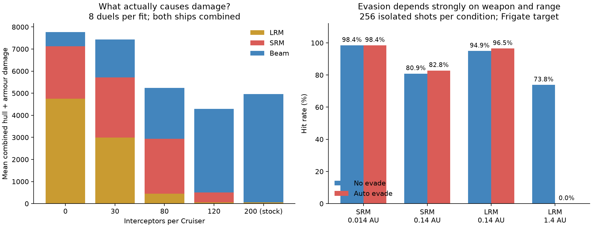

# Luminal balance review — 29 September 2026

The largest imbalance is defensive ammunition on capital ships. The corrected
interceptor guidance works, but Cruiser and Battleship magazines now erase most
of the SRM phase. Reducing those magazines restores the intended sequence much
more directly than weakening interceptor accuracy or increasing missile damage.

**Recommended next tuning:** Cruiser interceptors **200 → 80**, Battleship
interceptors **240 → 120**. Keep the guidance fix, missile flight parameters,
warheads and beam damage unchanged for that first tuning pass. These are tested
candidates, not changes applied by this review.



## What was tested

Production mechanics are commit `e0cdbfa`. Changes accompanying this report only
extend the calibration runner and record experiments; they do not tune the game.

There are **10,582 recorded trial executions**:

- 10,240 isolated missile shots: 5,120 normal-envelope shots, 1,536 beyond-envelope
  shots, 2,304 closing/receding powered-target shots, and 1,280 class/evasion shots.
- 100 stock equal-class battles, 20 seeds per class.
- 60 close beam-only controls, 12 per class; the 12 unarmed Picket controls
  correctly do not produce beam combat.
- 152 paired tactical, sensor, ammunition and mixed-class duels, eight seeds per case.
- 16 Battleship ammunition counterfactuals.
- Eight actual escort/raider mission runs using `Doctrine` and mission objectives.
- Two extended-duration Cruiser runs and four repeated Destroyer timeout diagnostics.

[Complete tables and confidence intervals](tables.md), [variant manifest](variant-manifest.json),
[mission outcomes](missions.csv), and all raw CSVs are alongside this report.
The four Destroyer diagnostics repeat earlier scenarios, so they are not extra
independent evidence. The two extended runs reuse opening-range seeds too.

The earlier duel pilot began with precise tracks and withheld SRMs until 0.02 AU.
The new pilot can fire them at their 0.14 AU engagement range. We retained the old
pilot as a paired control and tested natural track acquisition separately. The
new pilot still differs from actual Doctrine: it queues aggressively and manages
heat explicitly. Mission trials exercise that separate layer.

## 1. Capital defenses suppress the intended weapon progression

Mean damage per battle below is **hull plus armour HP, both ships combined**.
It is not a per-shot damage estimate; earlier kills change subsequent exposure.

| Cruiser interceptors per ship | LRM damage | SRM damage | Beam damage | Beam finishes |
| --- | ---: | ---: | ---: | ---: |
| 200, current stock | 61 | 0 | 4,907 | 8/8 |
| 120 | 61 | 444 | 3,779 | 8/8 |
| 80 | 454 | 2,489 | 2,294 | 6/8 |
| 30 | 2,997 | 2,719 | 1,722 | 8/8 |
| 0 | 4,746 | 2,385 | 635 | 4/8 |

The **80-round Cruiser** is the best tested match for the requested progression:
occasional damaging LRMs, substantial SRM damage with some missile finishes,
then decisive beams in most fights. At 120, SRMs still contribute relatively
little. At 30, LRMs become a major damage source. Removing interceptors also
produced a mutual propulsion-disable timeout.

Battleships show the same stockpile problem. With **120 interceptors**, eight
equal-class fights averaged 33 LRM, 2,682 SRM and 8,861 beam damage; all eight
finished with beams. At 80 rounds, SRM damage rose to 3,681 and seven of eight
finished with beams. The 120-round fit preserves a larger reserve while allowing
SRMs to matter. These samples are exploratory, not precise win-rate estimates.

The wider offensive banks are already present. A capital ship still has time
and ammunition for repeated interceptor attempts against each inbound round.
Changing ammunition addresses defensive endurance while retaining the improved
ability to hit an individual accelerating SRM.

## 2. Classes currently experience different games

The 20-seed stock survey uses the original close-SRM pilot for continuity:

| Class | Mean LRM / SRM / beam damage | Beam finishes | Eight-hour timeouts |
| --- | --- | ---: | ---: |
| Picket | 0 / 1,256 / 0 | 0/20 | 0/20 |
| Frigate | 41 / 562 / 834 | 20/20 | 0/20 |
| Destroyer | 51 / 2,897 / 174 | 7/20 | 4/20 |
| Cruiser | 54 / 8 / 4,254 | 20/20 | 0/20 |
| Battleship | 51 / 82 / 15,957 | 20/20 | 0/20 |

Frigates are closest to the intended mixed-weapon progression. Destroyers are
far more vulnerable to the SRM phase and subsystem casualties. Capitals largely
skip meaningful missile damage. Pickets have no beams; one trial ended in mutual
destruction rather than a single winner.

Mixed-class results: Destroyer beat Frigate 8/8, Cruiser beat Destroyer 8/8,
and Battleship beat Cruiser in all 16 trials across both initial side assignments.
The larger hull has a clear advantage in these closing duels. These do not
measure cost efficiency, fleet combat, ambushes or escape success.

## 3. Missile physics give a strong pursuit/escape distinction

Against a stationary, undefended Frigate at 1.4 AU, LRMs hit **189/256 (73.8%)**,
consistent with the intended 75% baseline. Active support raised the observed
rate to **208/256 (81.2%)**. At 1.54 AU, hits remained 69.1%; at 1.68 AU they fell
to zero as the 120-minute reactor expired.

Stationary SRMs hit **207/256 (80.9%)** at 0.14 AU and 73.4% at 0.168 AU, but
**0/128 at 0.175 AU**. Their 22-minute endurance creates a sharp physical cutoff.
The visible nominal circles are useful engagement references, not hard maximum
ranges and not promises against receding targets.

At nominal range, a target already receding at 5,000 km/s defeated **all 256**
shots for each missile type. At half nominal range, the separate target-burn
experiment still hit receding, outward-accelerating targets in **124/128 SRM**
and **120/128 LRM** trials. Closing/inward-accelerating targets remained hittable
at nominal range: 106/128 SRMs and 100/128 LRMs. Burn commands were ±100 g and
remained subject to normal platform thermal/thrust limits.

This supports rewarding shots at pursuers and making outward shots harder.
The cliff comes from reach and lifetime, not a universal accuracy penalty.
The experiment varies target motion; it is not a direct test of every launcher
velocity/orientation combination. Launch-velocity inheritance has separate
existing regression coverage.

**Recommendation:** retain the physical budgets. Fire-control UI should make
predicted reach/expiry conspicuous; a circular range display alone cannot explain
why a nominal-range receding shot has virtually no chance.

## 4. Evasion works differently by missile and ship class

For the 256-seed Frigate sweep, close SRMs at 0.014 AU hit 98.4% with or without
auto-evasion. At 0.14 AU they hit 80.9% without evasion and 82.8% with it; this
small difference is not evidence that evasion helps missiles. Near the physical
limit at 0.168 AU, rates were 73.4% and 71.9%. SRMs generally retain enough powered
correction until the lifetime boundary.

LRMs are different. At 1.4 AU, auto-evasion reduced Frigate hits from 73.8% to
**0/256**. At 0.14 AU it did not produce a meaningful benefit. The nominal-range
64-seed class sweep found:

| Target class | LRM hits without evade | LRM hits with auto-evade |
| --- | ---: | ---: |
| Picket | 49/64 | 0/64 |
| Frigate | 49/64 | 0/64 |
| Destroyer | 51/64 | 0/64 |
| Cruiser | 49/64 | 49/64 |
| Battleship | 52/64 | 49/64 |

The smaller hulls can exploit the LRM's limited correction margin; the slower
capitals cannot reproduce that escape. Class trials isolate class thrust/thermal
scaling with defensive weapons and ECM disabled, rather than a full fitted duel.
Zero observed hits is not proof of impossibility: the 95% upper bound is 1.5%
for 0/256 and 5.7% for 0/64.

**Recommendation:** preserve the useful light-ship advantage. Do not globally
increase missile tracking to defeat it. SRM edge evasion is much weaker than LRM
edge evasion; treat that as a deliberate weapon distinction unless a separate
change is wanted.

## 5. Ping benefits are real, but stock capital defense hides them

Nominal-range isolated SRM hits rose from 80.9% to 89.1% with active support;
LRM hits rose from 73.8% to 81.2%. These samples have uncertainty, shown in the
full tables. Full-stock Cruiser duels still had almost no missile damage with
or without pings, so the benefit is hard to see in the battle outcome.

Starting without seeded tracks also produced completed fights in all eight
runs, with or without pings. At 0.35 AU these are not demanding stealth scenarios.
They do not measure an unseen cruise-LRM ambush; automatic ping resolution of
those contacts remains covered by functional tests, not a new ambush balance
sweep here. The natural-track cases had a 1/7 side split in this small seed set;
that warrants more seeds before diagnosing a sensor/order asymmetry.

**Recommendation:** reassess perceived ping value after correcting capital
ammunition budgets, before adding another global accuracy boost.

## 6. Beams finish fights; encounter pacing needs separate attention

All **48 beam-capable close beam-only duels** finished with beams. Median finish
times from 0.01 AU were 13.7 minutes for Frigates, 10.0 for Destroyers, 10.9 for
Cruisers and 9.2 for Battleships. Battleships also won all tested Cruiser matchups.
There is no evidence here that beams need a general damage buff. These totals
combine beam mounts; they do not isolate the spinal mount's contribution.

The full closing battles take much longer: stock class medians range from about
182 to 322 simulated minutes. Eight Cruiser encounters starting at 1.4 AU reached
the eight-hour cutoff without a kill, but two extended to 16 hours both finished
with beams, around an 11.3-hour median. That is slow encounter progression, not
a demonstrated permanent stalemate.

A Cruiser ordered to open range prevented resolution in seven of eight runs
at the eight-hour limit, but ended only about 0.01 AU away: it delayed the fight
rather than achieving a clean escape. Rush and 0.1-AU standoff did not overcome
the stock capital defense problem or show a convincing win advantage in eight
seeds. Jump escape was not commanded in this review.

All four Destroyer timeouts had at least one disabled drive; one had both.
Final separations ranged from 0.004 to 0.116 AU. Drive damage is associated with
the stalled endgames, but is not proven to be their only cause—one was already
within beam distance. Remaining weapon/system condition needs diagnosis before
changing the player's requested propulsion-damage rule.

Actual Doctrine/mission trials produced two escort victories and six runs with
no outcome by 12 hours. Some unfinished cases had spent their missiles; one
Battleship case had not fired any. This is a small pacing smoke test, not a
mission win-rate estimate. The actual bot does not use the duel pilot's explicit
heat-dump controller, and its navigation/ammunition-reserve rules differ.
Do not infer good mission pacing from the more decisive synthetic duels.

## Follow-up order

1. Apply the tested 80/120 Cruiser/Battleship interceptor stocks and rerun the
   same paired seeds, plus a fresh holdout set, with actual doctrine as well.
2. Diagnose disabled-but-alive endgames and bot encounter pacing. Preserve
   damaged propulsion being inoperative; consider doctrine, repair priorities
   and victory/disengagement handling before changing damage values.
3. Improve the explanation of reach/expiry in fire control. Retain the current
   missile acceleration/lifetimes, class-sensitive evasion and beam damage.
4. Separately test cruise-LRM ambushes, jump escapes and multi-ship saturation.
   They are not established by this one-on-one review.

## Reproduction and validation

```sh
cargo build --release -p luminal-cli
cargo test --release --workspace
./target/release/luminal-cli --missile-envelope 256 > calibration/2026-09-29-review/envelope.csv
./target/release/luminal-cli --edge-envelope 128 > calibration/2026-09-29-review/edge.csv
./target/release/luminal-cli --maneuver-envelope 128 > calibration/2026-09-29-review/maneuver.csv
./target/release/luminal-cli --class-evasion 64 > calibration/2026-09-29-review/class-evasion.csv
./target/release/luminal-cli --class-balance 20 all stock .35 12000 > calibration/2026-09-29-review/stock.csv
LUMINAL_DUEL_MISSILES=off ./target/release/luminal-cli --class-balance 12 all stock .01 16000 > calibration/2026-09-29-review/beams.csv
python3 calibration/2026-09-29-review/run_variants.py
python3 calibration/2026-09-29-review/run_missions.py
LUMINAL_DUEL_FIRE_RANGE=envelope ./target/release/luminal-cli --class-balance 8 Battleship 80,120 .35 24000 > calibration/2026-09-29-review/battleship-depths.csv
LUMINAL_DUEL_FIRE_RANGE=envelope LUMINAL_DUEL_STOP_S=57600 ./target/release/luminal-cli --class-balance 2 Cruiser stock 1.4 24000 > calibration/2026-09-29-review/opening-lrm-16h.csv
./target/release/luminal-cli --class-balance 2 Destroyer stock .35 12004 > calibration/2026-09-29-review/destroyer-timeouts-a.csv
./target/release/luminal-cli --class-balance 2 Destroyer stock .35 12010 > calibration/2026-09-29-review/destroyer-timeouts-b.csv
python3 calibration/2026-09-29-review/analyze.py
python3 calibration/2026-09-29-review/plot.py
```

The variant runner resumes existing ordered seed rows; remove its case CSVs to
rerun them after changing mechanics. Configuration is recorded in the manifest.
Envelope CSV seeds are offsets from 5000, maneuver seeds from 20000, and class
seed offsets from 36000. Duel/mission CSVs contain actual seeds.

The release workspace suite passed 315 tests with eight existing expensive
surveys ignored. Raw simulations above provide the additional balance evidence.
